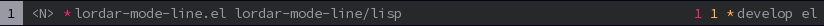

#+STARTUP: showall

* Lordar-mode-line                                               :Noexport_2:

[[https://www.gnu.org/licenses/gpl-3.0][https://img.shields.io/badge/License-GPL%20v3-blue.svg]] [[https://github.com/hubisan/lordar-mode-line/actions/workflows/tests.yml][https://github.com/hubisan/lordar-mode-line/actions/workflows/tests.yml/badge.svg]]

A minimal mode line for Emacs.

** Main features                                                :noexport_0:

- =Lordar-mode-line= includes only a few segments.
- It uses plain characters only, no icons.
- There is a default mode-line format, one for ~prog-mode~ and a minimal one for special buffers. You can customize these or add your own.
- To share a segment, write a new extension. No additional segments will be added to the core to preserve minimalism. 

-----

** Contents

- [[#installation][Installation]]
- [[#usage][Usage]]
- [[#customization][Customization]]
- [[#changelog][Changelog]]
- [[#contributing][Contributing]]

** Installation
:PROPERTIES:
:CUSTOM_ID: installation
:END:

This package is hosted on Github. Use your favourite way to install like [[https://github.com/progfolio/elpaca][Elpaca]], [[https://github.com/radian-software/straight.el][Straight]], [[https://github.com/quelpa/quelpa][Quelpa]].

Starting with Emacs 29 ~package-vc-install~ may be used, this what it looks like using ~use-package~:

#+BEGIN_SRC emacs-lisp
  (use-package lordar-mode-line
    ;; Minimal Emacs mode-line using ASCII characters only.
    ;; https://github.com/hubisan/lordar-mode-line
    :vc (:url "https://github.com/hubisan/lordar-mode-line"
              :branch "develop" :rev :newest :lisp-dir "lisp")
    :functions lordar-mode-line-mode
    :demand t
    :init
    ;; Check out the customization section of the README.org on how to change the
    ;; look of the mode line.
    :config
    (lordar-mode-line-mode))
#+END_SRC

** Usage
:PROPERTIES:
:CUSTOM_ID: usage
:END:

To activate the mode line use ~lordar-mode-line-mode~. This will setup up the default mode-line, a mode-line for ~prog-mode~, and a minimal mode-line for special buffers.

To modify the definitions change the variables ~lordar-mode-line-default-segments~, ~lordar-mode-line-prog-mode-segments~ or ~lordar-mode-line-minimal-segments~.

Each segments variable is a plist with the keys ~:left-important~, ~:left~, and ~:right~. Segments under ~:left-important~ are kept visible as long as possible when space is tight; ~:left~ is truncated first. ~:right~ is aligned to the right.

To define a custom mode-line for a major mode with the segments provided
- create a new variable holding the segments for the left and right side and
- modify ~lordar-mode-line-major-mode-definitions~ to include your new mode-line definition. 

*** Available Segments

The following segments are available:

- lordar-mode-line-segments-adjust-height (&optional factor) :: Adjust the mode-line height by a factor using invisible spaces. If factor is not set it uses ~lordar-mode-line-segments-adjust-height~.
  
- lordar-mode-line-segments-vertical-space (&optional width) :: Vertical space with space-width set to width. If width is nil, set it to 1.

- lordar-mode-line-segments-line-number :: The current line number.

- lordar-mode-line-segments-column-number :: The current column number.
  
- lordar-mode-line-segments-major-mode (&optional format-string) :: Return the pretty name of the current buffer's major mode. Use format-string to change the output format.
  
- lordar-mode-line-segments-buffer-name (&optional format-string) :: Return the name of the current buffer. Use format-string to change the output.
  
- lordar-mode-line-segments-buffer-status (&optional format-string) :: Return an indicator representing the status of the current buffer. Uses symbols defined in lordar-mode-line-buffer-status-symbols. Use format-string to change the output format.

- lordar-mode-line-segments-project-root-basename (&optional format-string) :: Return the project root basename. If not in a project the basename of default-directory is returned. Use format-string to change the output.
  
- lordar-mode-line-segments-project-root-relative-directory (&optional format-string) :: Return the directory path relative to the root of the project. If not in a project, the default-directory is returned. Use format-string to change the output format.
  
- lordar-mode-line-segments-vc-branch (&optional format-string) :: Return the vc branch formatted to display in the mode line. Use format-string to change the output.
  
- lordar-mode-line-segments-vc-state (&optional format-string) :: Return an indicator representing the vc status of the current buffer. Use format-string to change the output. The indicators defined in lordar-mode-line-vc-state-symbols are used.
  
- lordar-mode-line-segments-input-method (&optional format-string) :: Return the current input method. Use format-string to change the output.
  
- lordar-mode-line-segments-syntax-checking-error-counter (&optional format-string show-zero use-zero-faces) :: Return the errors counter report by enabled syntax checker. Use format-string to change the output. If show-zero is non-nil then also show the counter if it is zero. If use-zero-faces is non-nil then use special faces for zero count. 
  
- lordar-mode-line-segments-syntax-checking-warning-counter (&optional format-string show-zero use-zero-faces) :: Return the warnings counter report by enabled syntax checker. Use format-string to change the output. If show-zero is non-nil then also show the counter if it is zero. If use-zero-faces is non-nil then use special faces for zero count. 
  
- lordar-mode-line-segments-syntax-checking-note-counter (&optional format-string show-zero use-zero-faces) :: Return the note counter report by enabled syntax checker. Use format-string to change the output. If show-zero is non-nil then also show the counter if it is zero. If use-zero-faces is non-nil then use special faces for zero count.

- lordar-mode-line-segments-evil-state (&optional format-string) :: Return the value of evil-mode-line-tag. Use format-string to change the output.
  
- lordar-mode-line-segments-winum (&optional format-string) :: Return the winum number string for the mode line. Use format-string to change the output.

** Customization
:PROPERTIES:
:CUSTOM_ID: customization
:END:

*** Variables

Set the following variables to change the behaviour of the package:

- lordar-mode-line-default-segments :: Default segments used for the mode line. The plist keys are ~:left-important~, ~:left~, and ~:right~. ~:left-important~ is prioritized when the available width is too small. The default is:
  #+BEGIN_SRC emacs-lisp
    (setq lordar-mode-line-default-segments
      '(:left-important
        ((lordar-mode-line-segments-adjust-height)
         (lordar-mode-line-segments-winum " %s ")
         (lordar-mode-line-segments-evil-state " %s ")
         (lordar-mode-line-segments-buffer-status
          (concat "%s" (lordar-mode-line-segments-vertical-space 0.4)))
         (lordar-mode-line-segments-buffer-name "%s "))
        :left
        ((lordar-mode-line-segments-project-root-relative-directory "%s"))
        :right
        ((lordar-mode-line-segments-vc-state
          (concat " %s" (lordar-mode-line-segments-vertical-space 0.4)))
         (lordar-mode-line-segments-vc-branch "%s ")
         (lordar-mode-line-segments-major-mode "%s ")
         (lordar-mode-line-segments-input-method " %s "))))
  #+END_SRC

- lordar-mode-line-prog-mode-segments :: Segments used for the mode line in `prog-mode'. The default is:
  #+BEGIN_SRC emacs-lisp
    (setq lordar-mode-line-prog-mode-segments
      '(:left-important
        ((lordar-mode-line-segments-adjust-height)
         (lordar-mode-line-segments-winum " %s ")
         (lordar-mode-line-segments-evil-state " %s ")
         (lordar-mode-line-segments-buffer-status
          (concat "%s" (lordar-mode-line-segments-vertical-space 0.4)))
         (lordar-mode-line-segments-buffer-name "%s "))
        :left
        ((lordar-mode-line-segments-project-root-relative-directory "%s"))
        :right
        ((lordar-mode-line-segments-syntax-checking-error-counter " %s ")
         (lordar-mode-line-segments-syntax-checking-warning-counter "%s ")
         (lordar-mode-line-segments-syntax-checking-note-counter "%s ")
         (lordar-mode-line-segments-vc-state
          (concat "%s" (lordar-mode-line-segments-vertical-space 0.4)))
         (lordar-mode-line-segments-vc-branch "%s ")
         (lordar-mode-line-segments-major-mode "%s "))))
  #+END_SRC

- lordar-mode-line-minimal-segments :: Minimal segments for mode like `special-mode'. The default is:
  #+BEGIN_SRC emacs-lisp
    (setq lordar-mode-line-minimal-segments
      '(:left-important
        ((lordar-mode-line-segments-adjust-height)
         (lordar-mode-line-segments-winum " %s ")
         (lordar-mode-line-segments-evil-state " %s ")
         (lordar-mode-line-segments-buffer-status
          (concat "%s" (lordar-mode-line-segments-vertical-space 0.4)))
         (lordar-mode-line-segments-buffer-name "%s "))
        :left nil
        :right
        ((lordar-mode-line-segments-major-mode "%s "))))
  #+END_SRC

- lordar-mode-line-major-mode-definitions :: Definition of mode line segments to use per major mode. Each key can be a single major mode symbol or a list of major mode symbols. The corresponding value must be a variable containing the segments. By default a major mode specific mode line is used for prog-mode and for some special modes. The default is:
  #+BEGIN_SRC emacs-lisp
    (setq lordar-mode-line-major-mode-definitions
          '((prog-mode . lordar-mode-line-prog-mode-segments)
            ((Info-mode ibuffer-mode special-mode)
             . lordar-mode-line-minimal-segments)))
  #+END_SRC
  
- lordar-mode-line-height-adjust-factor :: Default factor to use for lordar-mode-line-segments-adjust-height. The height is a multiple of the height of the text and is added at the bottom and at the top. This only works if the segment ~lordar-mode-line-segments-adjust-height~ is used. The default is ~0.2~.

- lordar-mode-line-buffer-status-symbols :: Symbols for buffer status (segment: lordar-mode-line-segments-buffer-status) in the mode line. Each entry is a cons cell with a keyword and a corresponding string. Default:
  #+BEGIN_SRC emacs-lisp
    (setq lordar-mode-line-buffer-status-symbols
          ((buffer-not-modified . nil)
           (buffer-modified . "*")
           (buffer-read-only . "%")))
  #+END_SRC
    
- lordar-mode-line-vc-state-symbols :: Symbols for buffer status in the mode line. Each entry is a cons cell with a keyword and a corresponding string. Default:
  #+BEGIN_SRC emacs-lisp
    (setq lordar-mode-line-vc-state-symbols
          ((up-to-date) (edited . "*")
           (needs-update . "!u") (needs-merge . "!m")
           (added . "*") (removed . "x")
           (conflict . "!c") (ignored . "x")
           (default . nil)))
  #+END_SRC

*** Faces

For each segment there is a normal and an inactive face. Like this it is possible to style each segment separately and to style differently whether the mode line is active or not.

To see the faces just use ~customize-group~ and select ~lordar-mode-line-faces~.

** Changelog
:PROPERTIES:
:CUSTOM_ID: changelog
:END:

See the [[./CHANGELOG.org][changelog]].

** Contributing
:PROPERTIES:
:CUSTOM_ID: contributing
:END:

Use the issue tracker to reports bugs, suggest improvements or propose new features. If you want to contribute please open a pull request after having opened a new issue.

In any case please check out the [[./CONTRIBUTING.org][contributing guidelines]] beforehand.
